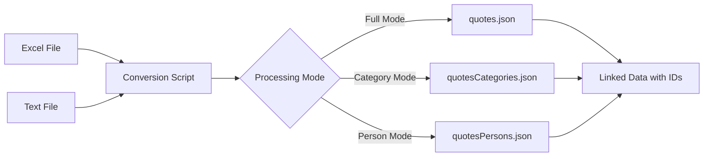

# Excel To Json

A Node.js application for converting Excel spreadsheets and text files containing quotes into structured JSON data.

Built in May 2020, this JavaScript project processes .xlsx and semicolon-separated TXT files, extracting quotes, person names, and categories into organized JSON outputs. It normalizes author names, cleans text formatting, prevents duplicate entries, and creates linked datasets with unique IDs. Designed for web applications, APIs, or databases, the project generates separate JSON files for quotes, persons, and categories while keeping data clean, consistent, and easy to reuse.

## Features

- 📊 Converts Excel files (.xlsx) to JSON format
- 📝 Processes text files with semicolon-separated values
- 👤 Extracts and normalizes person names (handles various formats)
- 🏷️ Organizes quotes by categories
- 🔗 Creates relational structure with unique IDs
- 🧹 Cleans and normalizes text data automatically
- 🚫 Prevents duplicate entries for persons and categories
- 📦 Generates separate JSON files for quotes, persons, and categories

### Core Capabilities

- **Excel and Text File Processing**: Supports .xlsx and semicolon-separated TXT files
- **Data Normalization**: Cleans and standardizes text, names, and categories
- **Relational Data Structure**: Creates linked datasets with unique IDs
- **Duplicate Prevention**: Identifies and reuses existing persons and categories
- **Multiple Output Modes**: Category extraction, person extraction, or full quotes generation

### Technical Excellence

- **Node.js with ES6+**: Modern JavaScript syntax and features
- **xlsx Library**: Robust Excel file processing
- **Readline Streaming**: Efficient text file reading
- **ESLint**: Code quality and consistency
- **Error Handling**: Graceful skipping of invalid entries with detailed logging

### Developer Experience

- **Simple Configuration**: Centralized settings in src/settings/settings.js
- **Clear Project Structure**: Organized directories for data, output, and services
- **Debug Support**: Built-in debug script for development
- **Multiple Processing Modes**: Easy to switch between category/person/full modes

## Getting Started

### Prerequisites

- Node.js (v8 or higher)
- npm or yarn

### Installation

1. Clone the repository:

```bash
git clone https://github.com/orassayag/excel-to-json.git
cd excel-to-json
```

2. Install dependencies:

```bash
npm install
```

### Configuration

Place your data files in the `src/data/` directory:

- `quotes.xlsx` - Excel file with quotes (columns: Quote, Person, Category)
- `quotes.txt` - Text file with semicolon-separated data

Edit settings in `src/settings/settings.js` if needed:

```javascript
{
  NODE_ENV: 'development',
  SERVER_PORT: '3001'
}
```

## Usage

### Basic Conversion

Run the conversion script:

```bash
npm start
```

This generates JSON files in the `src/dist/` directory:

- `quotes.json` - Quotes with linked person and category IDs
- `quotesCategories.json` - Category definitions
- `quotesPersons.json` - Person definitions

### Processing Modes

Edit `back-server.js` to change processing modes:

**Extract Categories:**

```javascript
const isCategoryMode = true;
const isPersonMode = false;
```

**Extract Persons:**

```javascript
const isCategoryMode = false;
const isPersonMode = true;
```

**Generate Full Quotes:**

```javascript
const isCategoryMode = false;
const isPersonMode = false;
```

## Project Structure

```
excel-to-json/
├── src/
│   ├── data/               # Input data files (Excel, TXT)
│   ├── dist/               # Generated JSON output files
│   ├── services/           # Utility services
│   │   └── error.service.js
│   ├── settings/           # Configuration
│   │   └── settings.js
│   └── server.js           # HTTP server setup
├── back-server.js          # Main conversion script
├── server.js               # Alternative server entry point
├── package.json
└── README.md
```

## Data Flow



## Input Format

### Excel File (quotes.xlsx)

| Quote              | Person              | Category         |
| ------------------ | ------------------- | ---------------- |
| "Example quote..." | Author Name         | Category Name    |
| "Another quote..." | LastName, FirstName | Another Category |

### Text File (quotes.txt)

```
1;Example quote...;Author Name;Category Name
2;Another quote...;LastName, FirstName;Another Category
```

## Output Format

### Quotes JSON

```json
{
  "1": {
    "quote": "Example quote...",
    "name": "Author Name",
    "categoryId": 1
  }
}
```

### Categories JSON

```json
{
  "1": {
    "id": 1,
    "name": "Category Name",
    "iconName": " "
  }
}
```

### Persons JSON

```json
{
  "1": {
    "id": 1,
    "name": "Author Name",
    "profession": " ",
    "wikipediaURL": " "
  }
}
```

## Available Scripts

### Start

Run the conversion:

```bash
npm start
```

### Debug

Run with Node.js debugger:

```bash
npm run debug
```

### Stop

Stop all Node.js processes (Windows):

```bash
npm run stop
```

## Features in Detail

### Name Normalization

- Converts "LastName, FirstName" to "FirstName LastName"
- Removes extra whitespace
- Handles various name formats

### Text Cleaning

- Removes line breaks and normalizes spacing
- Trims leading/trailing whitespace
- Consolidates multiple spaces

### Duplicate Prevention

- Identifies existing persons and categories
- Reuses IDs for duplicates
- Maintains referential integrity

### Error Handling

- Validates data before processing
- Skips invalid entries gracefully
- Logs errors with detailed information

## Development

The project uses:

- **Node.js** with ES6+ features
- **xlsx** library for Excel file processing
- **readline** for text file streaming
- **ESLint** for code quality

### Architecture Principles

- **Simplicity**: Keep the codebase simple and easy to understand
- **Modularity**: Separate concerns into different files and functions
- **Maintainability**: Write clean, readable code with clear logic
- **Error Resilience**: Gracefully handle invalid data and errors
- **Data Consistency**: Ensure normalized and consistent output data

## Architecture

This project follows a straightforward, script-based architecture:

- **Entry Point**: back-server.js - main conversion script
- **Configuration**: src/settings/settings.js - centralized settings
- **Services**: src/services/ - utility functions (error handling)
- **Data Flow**: Input files → Processing → Output JSON files

### Directory Structure

```
excel-to-json/
├── src/
│   ├── data/               # Input data files (Excel, TXT)
│   ├── dist/               # Generated JSON output files
│   ├── services/           # Utility services
│   │   └── error.service.js
│   ├── settings/           # Configuration
│   │   └── settings.js
│   └── server.js           # HTTP server setup
├── back-server.js          # Main conversion script
├── server.js               # Alternative server entry point
├── package.json
└── README.md
```

### Design Patterns

- **Module Pattern**: Organized code into separate files
- **Configuration Pattern**: Centralized settings in a single file
- **Pipeline Pattern**: Input → Processing → Output flow
- **Idempotent Operations**: Duplicate prevention ensures consistent results

## Best Practices

### For Data Preparation

1. **Clean Source Data**: Ensure Excel and text files have consistent formatting
2. **Use Consistent Naming**: Follow "FirstName LastName" or "LastName, FirstName" for authors
3. **Validate Categories**: Use consistent category names to avoid duplicates
4. **Backup Original Data**: Keep copies of source files before processing

### For Development

1. **Test with Sample Data**: Use small datasets for testing
2. **Check Outputs**: Verify generated JSON files after processing
3. **Version Control**: Commit changes before making major modifications
4. **Document Changes**: Keep track of modifications to the processing logic

## Contributing

Contributions to this project are [released](https://help.github.com/articles/github-terms-of-service/#6-contributions-under-repository-license) to the public under the [project's open source license](LICENSE).

Everyone is welcome to contribute. Contributing doesn't just mean submitting pull requests—there are many different ways to get involved, including answering questions and reporting issues.

Please feel free to contact me with any question, comment, pull-request, issue, or any other thing you have in mind.

## Support

For questions, issues, or contributions:

- **GitHub Issues**: [https://github.com/orassayag/excel-to-json/issues](https://github.com/orassayag/excel-to-json/issues)
- **Email**: orassayag@gmail.com

## Author

- **Or Assayag** - _Initial work_ - [orassayag](https://github.com/orassayag)
- Or Assayag <orassayag@gmail.com>
- GitHub: https://github.com/orassayag
- StackOverflow: https://stackoverflow.com/users/4442606/or-assayag?tab=profile
- LinkedIn: https://linkedin.com/in/orassayag

## License

This application has an MIT license - see the [LICENSE](LICENSE) file for details.

## Acknowledgments

- Built for educational and research purposes
- Respects robots.txt and implements rate limiting
- Uses user-agent rotation to avoid detection
- Implements polite crawling practices
