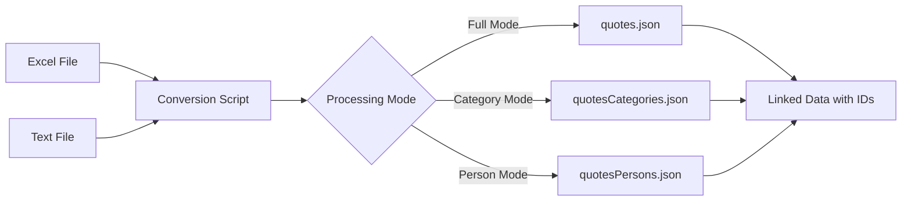

# Excel To JSON

A Node.js application to convert Excel spreadsheets and text files containing quotes data into structured JSON files with normalized person names and categories.

Built in May 2020. This JavaScript application processes quotes from multiple file formats, extracts and normalizes metadata, and generates organized JSON output suitable for use in web applications, APIs, or databases.

## Features

- 📊 Converts Excel files (.xlsx) to JSON format
- 📝 Processes text files with semicolon-separated values
- 👤 Extracts and normalizes person names (handles various formats)
- 🏷️ Organizes quotes by categories
- 🔗 Creates relational structure with unique IDs
- 🧹 Cleans and normalizes text data automatically
- 🚫 Prevents duplicate entries for persons and categories
- 📦 Generates separate JSON files for quotes, persons, and categories

## Getting Started

### Prerequisites

- Node.js (v8 or higher)
- npm or yarn

### Installation

1. Clone the repository:
```bash
git clone https://github.com/orassayag/excel-to-json.git
cd excel-to-json
```

2. Install dependencies:
```bash
npm install
```

### Configuration

Place your data files in the `src/data/` directory:
- `quotes.xlsx` - Excel file with quotes (columns: Quote, Person, Category)
- `quotes.txt` - Text file with semicolon-separated data

Edit settings in `src/settings/settings.js` if needed:
```javascript
{
  NODE_ENV: 'development',
  SERVER_PORT: '3001'
}
```

## Usage

### Basic Conversion

Run the conversion script:
```bash
npm start
```

This generates JSON files in the `src/dist/` directory:
- `quotes.json` - Quotes with linked person and category IDs
- `quotesCategories.json` - Category definitions
- `quotesPersons.json` - Person definitions

### Processing Modes

Edit `back-server.js` to change processing modes:

**Extract Categories:**
```javascript
const isCategoryMode = true;
const isPersonMode = false;
```

**Extract Persons:**
```javascript
const isCategoryMode = false;
const isPersonMode = true;
```

**Generate Full Quotes:**
```javascript
const isCategoryMode = false;
const isPersonMode = false;
```

## Project Structure

```
excel-to-json/
├── src/
│   ├── data/               # Input data files (Excel, TXT)
│   ├── dist/               # Generated JSON output files
│   ├── services/           # Utility services
│   │   └── error.service.js
│   ├── settings/           # Configuration
│   │   └── settings.js
│   └── server.js           # HTTP server setup
├── back-server.js          # Main conversion script
├── server.js               # Alternative server entry point
├── package.json
└── README.md
```

## Data Flow



## Input Format

### Excel File (quotes.xlsx)

| Quote | Person | Category |
|-------|--------|----------|
| "Example quote..." | Author Name | Category Name |
| "Another quote..." | LastName, FirstName | Another Category |

### Text File (quotes.txt)

```
1;Example quote...;Author Name;Category Name
2;Another quote...;LastName, FirstName;Another Category
```

## Output Format

### Quotes JSON
```json
{
  "1": {
    "quote": "Example quote...",
    "name": "Author Name",
    "categoryId": 1
  }
}
```

### Categories JSON
```json
{
  "1": {
    "id": 1,
    "name": "Category Name",
    "iconName": " "
  }
}
```

### Persons JSON
```json
{
  "1": {
    "id": 1,
    "name": "Author Name",
    "profession": " ",
    "wikipediaURL": " "
  }
}
```

## Available Scripts

### Start
Run the conversion:
```bash
npm start
```

### Debug
Run with Node.js debugger:
```bash
npm run debug
```

### Stop
Stop all Node.js processes (Windows):
```bash
npm run stop
```

## Features in Detail

### Name Normalization
- Converts "LastName, FirstName" to "FirstName LastName"
- Removes extra whitespace
- Handles various name formats

### Text Cleaning
- Removes line breaks and normalizes spacing
- Trims leading/trailing whitespace
- Consolidates multiple spaces

### Duplicate Prevention
- Identifies existing persons and categories
- Reuses IDs for duplicates
- Maintains referential integrity

### Error Handling
- Validates data before processing
- Skips invalid entries gracefully
- Logs errors with detailed information

## Development

The project uses:
- **Node.js** with ES6+ features
- **xlsx** library for Excel file processing
- **readline** for text file streaming
- **ESLint** for code quality

## Contributing

Contributions to this project are [released](https://help.github.com/articles/github-terms-of-service/#6-contributions-under-repository-license) to the public under the [project's open source license](LICENSE).

Everyone is welcome to contribute. Contributing doesn't just mean submitting pull requests—there are many different ways to get involved, including answering questions and reporting issues.

Please feel free to contact me with any question, comment, pull-request, issue, or any other thing you have in mind.

## Author

* **Or Assayag** - *Initial work* - [orassayag](https://github.com/orassayag)
* Or Assayag <orassayag@gmail.com>
* GitHub: https://github.com/orassayag
* StackOverflow: https://stackoverflow.com/users/4442606/or-assayag?tab=profile
* LinkedIn: https://linkedin.com/in/orassayag

## License

This application has an MIT license - see the [LICENSE](LICENSE) file for details.
